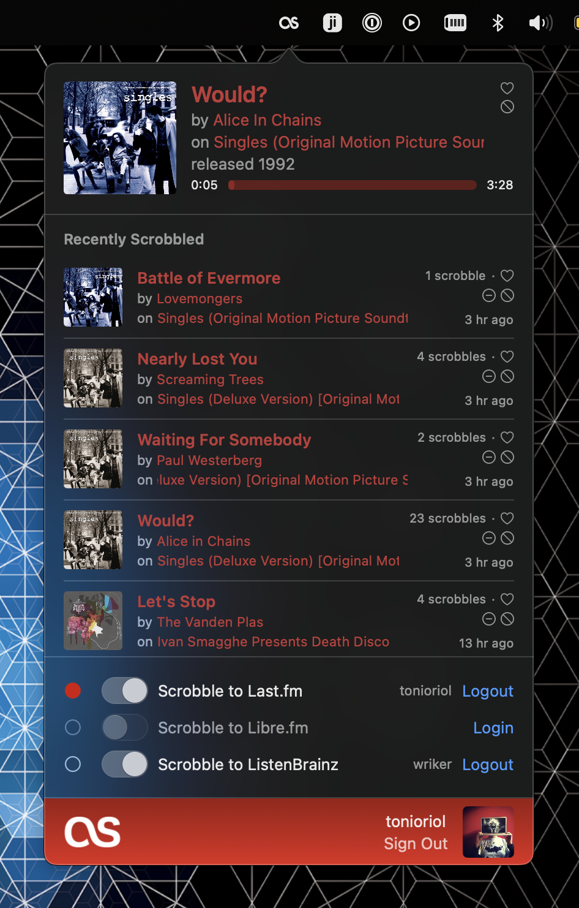

# Scroblebler for Apple Music


Scroblebler is a native macOS application capable of scrobbling tracks from Apple Music (even when
they are not in your library).

## Features

- **Multiple Scrobbling Services**: Support for Last.fm, ListenBrainz, and Libre.fm
-️ **Track Loving**: Love/unlove tracks directly from the app
- **Blacklist Management**: Blacklist tracks to prevent unwanted scrobbles
-️ **Undo Support**: Undo recent scrobbles
- **Play Count Display**: View play counts for your tracks
- **Listening History**: Browse your recent scrobbles
- **Profile View**: View your scrobbling profile information
- **Album Artwork**: Display beautiful album artwork
- **Now Playing**: Real-time now playing updates
- **Launch at Startup**: Automatically start scrobbling when you log in

## Screenshot



## Installing

### Homebrew

```bash
brew install tonioriol/scroblebler/scroblebler
```

### Manual

Download the latest DMG from [Releases](https://github.com/tonioriol/scroblebler/releases/latest) and drag Scroblebler to Applications.

**First launch:** Right-click the app and select "Open" to bypass Gatekeeper.

## Building

1. Clone this repository
2. Open `Scroblebler.xcodeproj`, and build it.

## Credits

This project is a fork of the original [Audioscrobbler](https://github.com/heyvito/audioscrobbler) by Victor Gama, with additional features.

## Oh no, you pushed your token and secret!

Yep. I know! There's not much one can do with the API, and even Last.fm's tokens are [available
on their repository](https://github.com/lastfm/lastfm-desktop/blob/9ae84cf4ab204a92e6953abe14026df70c140519/lib/unicorn/UnicornCoreApplication.cpp#L58)

## Known Issues

- Music.app may restart immediately after quiting. I intend to fix this in the near future.

## TODO

- [x] Sign, Notarize & Provide DMG installer
- [x] Start at Login
- [ ] Use proper logger
- [ ] Update the date and the (c) of the new files.
- [ ] Update the reverse domain.
- [ ] Offline support
- [ ] Auto-update

## License

This project is licensed under the MIT License - see the [LICENSE](LICENSE) file for details.
