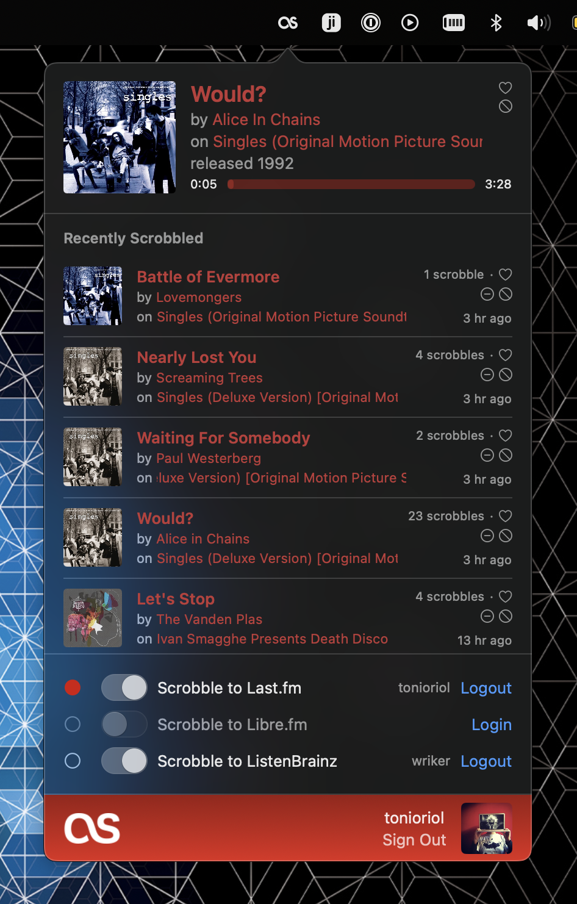

# Scroblebler for Apple Music


Scroblebler is a native macOS application capable of scrobbling tracks from Apple Music (even when
they are not in your library).

## Features

- **Multiple Scrobbling Services**: Support for Last.fm, ListenBrainz, and Libre.fm
- **Unidirectional Sync**: Sync your listening history from a primary service to secondary services
- **Service-Specific Branding**: Visual indicators for each scrobbling service with logos and colors
- **Track Loving**: Love/unlove tracks directly from the app
- **Blacklist Management**: Blacklist tracks to prevent unwanted scrobbles
- **Undo Support**: Undo recent scrobbles
- **Play Count Display**: View play counts for your tracks
- **Listening History**: Browse your recent scrobbles with detailed track information and links
- **Profile View**: View your scrobbling profile with avatar and statistics
- **Album Artwork**: Display beautiful album artwork
- **Now Playing**: Real-time now playing updates
- **Launch at Startup**: Automatically start scrobbling when you log in

## Screenshot



## Installing

### Homebrew (Recommended)

```bash
brew install --cask tonioriol/scroblebler/scroblebler
```

### Manual

Download the latest DMG from [Releases](https://github.com/tonioriol/scroblebler/releases/latest) and drag Scroblebler to Applications.

After installation, remove quarantine attributes:
```bash
xattr -cr /Applications/Scroblebler.app
```

## Building

### Prerequisites

- Xcode 15.0+

### From Xcode

1. Clone this repository:
   ```bash
   git clone https://github.com/tonioriol/scroblebler.git
   cd scroblebler
   ```

2. Open `Scroblebler.xcodeproj` in Xcode

3. Xcode will automatically fetch the Swift package dependencies

4. Build the project (⌘B)

**Note**: On first build, you must configure the MediaRemoteAdapter framework embedding:
   - Select the Scroblebler target
   - Go to General tab
   - Under "Frameworks, Libraries, and Embedded Content"
   - Set MediaRemoteAdapter.framework to "Embed & Sign"

### Release Build

To create a release DMG:
```bash
./scripts/build.sh <version>
```


## Credits

This project is a fork of the original [Audioscrobbler](https://github.com/heyvito/audioscrobbler) by Victor Gama, with additional features.

Media playback control and detection uses [mediaremote-adapter](https://github.com/ejbills/mediaremote-adapter) by ejbills (forked from ungive's original work), which provides a Swift interface to macOS's private MediaRemote framework.

## Oh no, you pushed your token and secret!

Yep. I know! There's not much one can do with the API, and even Last.fm's tokens are [available
on their repository](https://github.com/lastfm/lastfm-desktop/blob/9ae84cf4ab204a92e6953abe14026df70c140519/lib/unicorn/UnicornCoreApplication.cpp#L58)

## Known Issues

- Music.app may restart immediately after quiting. I intend to fix this in the near future.

## TODO

- [x] Sign, Notarize & Provide DMG installer
- [x] Start at Login
- [ ] Use proper logger
- [ ] Update the date and the (c) of the new files.
- [ ] Update the reverse domain.
- [ ] Offline support
- [ ] Auto-update
- [ ] Testing
- [ ] Extract and unify the exponential backoff logic
- [ ] add playcontrols
- [ ] show multiple playing sources in player
- [ ] local first approach, store scrobbles locally and sync in background
- [ ] stop the constant reloading of images on scroll in history view

## License

This project is licensed under the MIT License - see the [LICENSE](LICENSE) file for details.
